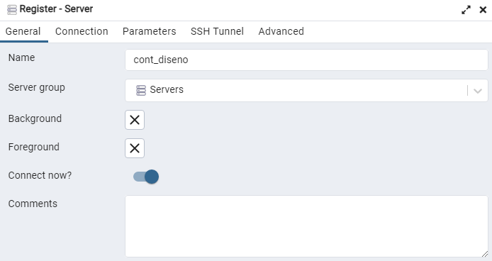
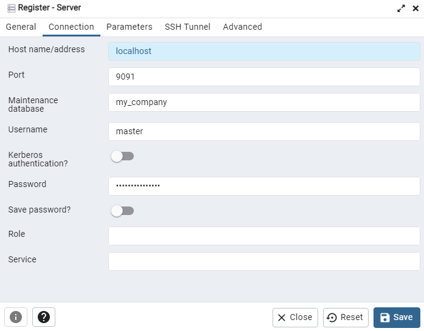

## Construyendo una base de datos relacional desde cero usando PostGreSQL

- **Estado del proyecto**: En desarrollo


### Métodos utilizados
-	Planificación del esquema de base de datos
-	Construcción del diagrama de relación de entidad
-	Implementación de base de datos
-	Creación de consultas SQL, uniones, consultas anidadas, etc.

### Tecnologías utilizadas
-	PostGreSQL
-	Docker
-	VSCode
-	dbdiagram
-	Notion

###Introducción
Este proyecto se enfoca en desarrollar una base de datos integral para respaldar el sistema de ventas de la empresa.

El sistema esta diseñado para ser utilizado mediantes PL, Funciones y Vistas. Y tiene la finalidad es optimizar la gestión de proveedores, clientes, productos y transacciones de venta.

La base de datos esta creada en PostgresSQL y esta a su vez esta en un contenedor en Docker. Éste contenedor esta automatizado para que al ejecutar el contenedor se cree todas las tablas y funciones del sistema, quedo como paso final conectarse a la base de datos y probarla. 

*Los pasos de instalación y ejecución están en la sesion de Tutoriales (más a abajo).
*
### Objetivos del Sistema de Ventas: (Completar)
- Garantizar un control efectivo de proveedores, clientes, productos y ventas.
- Mejorar la eficiencia en la gestión de inventarios y transacciones comerciales.

### Entidades y Atributos

- **Proveedores:** rut_proveedor, nombre, dirección, teléfono, página_web .

- **Clientes:** RUT, nombre, dirección (calle, número, comuna, ciudad), teléfonos. 

- **Contactos_clientes:** id_contacto,  rut_cliente, telefono.

- **Productos**: codigo_producto, nombre, precio, stock, rut_proveedor, id_categoria.

- **Categoría**:  Id, nombre_categoria, descripción.

- **Ventas**: factura, fecha, rut_cliente, descuento.

- **Ventas_detalle**: factura, monto_total

- **Productos_vendidos **: id_venta , factura , codigo_producto , cantidad , precio.

- **Auditoria_productos **: id_auditoria, codigo, nombre, precio, stock, rut_proveedor, id_categoria, fecha_modificacion, usuario.

## Relaciones entre Entidades:

- Proveedor está relacionado con Producto.

- Cliente está relacionado con Venta.

- Producto está relacionado con Categoría

## Diseño de Tablas: (Nombre, Descripción y Atributos)


#### - Clientes
Son las personas u organizaciones que compran nuestros productos. Almacenará toda la información relevante para la emision de la factura.

		-Rut_cliente
		- Nombre
		- Ciudad
		- Comuna
		- Calle
#### -	 Contactos_clientes
- Datos de contactos de los clientes. Almacenará los multiples datos de contacto que puede tener un contacto.

		 -Id
		- Rut_cliente
		- Teléfono
#### - Productos
Son los productos que nuestra empresa comercializa. Almacena toda la infomación de nuestros productos.

		- Codigo
		- Nombre
		- Precio
		- Stock
		- Rut_proveedor
		- Id_categoria
#### - Proveedores
Son las empresas a las que les compramos nuestros productos. Almacena solo la información relevante al origen del producto.

		- Rut_proveedor
		- Nombre
		- Dirección
		- Telefono
		- Pagina_web
#### - Categoría
Los productos pertenecen a una ùnica categoría. Almacenará el nombre y su descripciòn.

		-Id
		- Nombre_categoría
		- Descripción
#### - Ventas
Son las ventas realizadas por los clientes. Almacenan información del clientes y los productos que compró.

		- Factura
		- Fecha
		- Rut_cliente
		- Descuento
#### - Productos_vendidos
Son los productos comprados por nuestos clientes. Almacena los productos asociados a la factura.

		- Id_venta
		- Factura
		- Codigo_producto
		- Cantidad
		- Precio
#### - Ventas_detalles
Sirve para almacenar los motos totales de las facturas emitidas.

		- Factura
		- Monto_total
#### - Auditoria_productos
Sirve para detectar los cambios realizados en la tabla Productos. Almacena los datos previo a una actualización junto con el usuario y fecha.

		- Id
		- Codigo
		- Nombre
		- Precio
		- Stock
		- Rut_proveedor
		- Id_categoria
		- Fecha_modificacion
		- Usuario

### Normalización

La normalización de esta base de datos esta basada en la 3FN, para reducir redundancias y mejorar la eficiencia.

###		Consultas y Reportes:
-	Ejemplos de consultas para obtener información relevante, como ventas por cliente o sus ventas, hasta por los productos en stock.
-	Reportes para el análisis de ventas mensuales.
*(Algunas de estas consulta estan implementadas en Vistas Regulares)*

###Consideraciones de Rendimiento y Escalabilidad:

-	Implementación de índices para mejorar la velocidad de las consultas.
-	Planificación para escalabilidad futura, considerando el crecimiento del negocio..

###	Plan de Implementación:
-	Fases de implementación, desde el diseño hasta la migración y pruebas en el entorno de producción.
-	Solución anticipada de posibles desafíos durante la implementación.

###	Conclusiones
-	La base de datos propuesta fortalecerá la gestión comercial, proporcionando una estructura sólida y eficiente para el sistema de ventas.

###	Preguntas y Discusión:
-	¿Algún aspecto específico que deseen destacar o discutir?
-	Estoy abierto a preguntas y sugerencias para mejorar el diseño de la base de datos.
-	Mejoras que me gustarían implementar:
	- Hacer el proyecto completamente en inglés.
	- Eliminar algunos de los 'Raise Notice' de las funciones para tener un retornos mas limpio.


###	Descargar
- 	Clona este repositorio y Ejecuta el docker-compose (para obtener ayuda, consulta este tutorial).

 #### Requisitos
 - Tener Git instalado.
 - Tener Docker instalado y en ejecución.
 - Tener el gestor PgAdmin o algún gestor de base de datos.


### Lea los tutoriales:
**1. Clona este repositorio.**
```
git clone https://github.com/JAlexCastro/repo_diseno_db.git
```
**2. Ubicate en el directorio raiz del proyecto. **(En la misma ubicación del archivo 'docker-compose')
```
cd  repo_diseno_db
```
**3. Ejecuta el comando para crear e iniciar el conenedor**
```
docker compose up
```
### Pasos para conectarse a la base de datos desde el PgAdmin

#### Datos de conección
  #####  Name:  Selecciona un nombre
  #####  Host Name:  localhost
  ##### Port: 9091
  ##### Maintenance database: my_company
  ##### Username: master
  ##### Password: master_password

- Nombre del servidor




- Datos de conexion:



### Contacto
Todos los comentarios son recibidos calurosamente.

Me pueden contactar a través de mi Linkedin: https://cl.linkedin.com/in/alejandro-castro-a173a0221